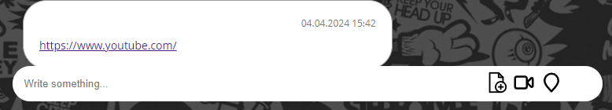
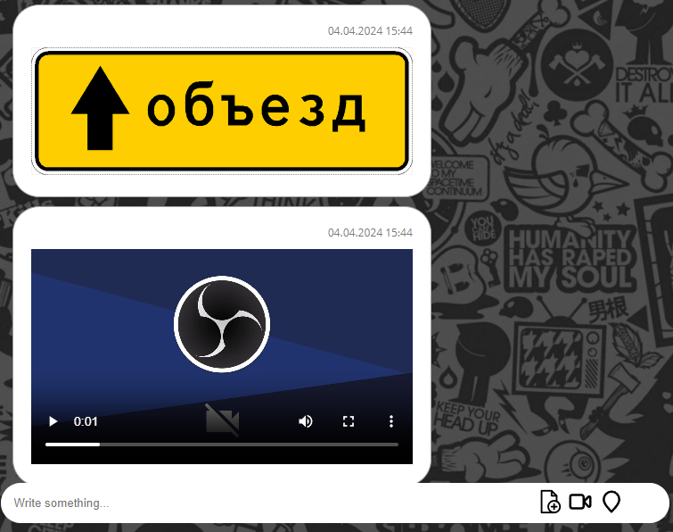
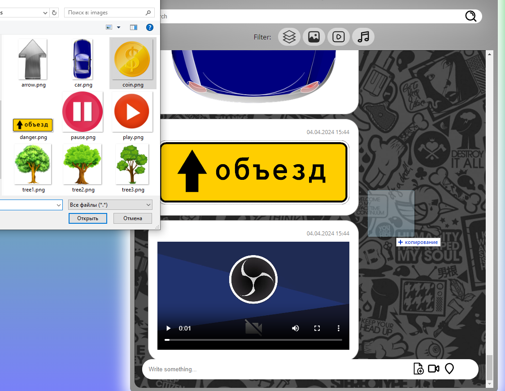
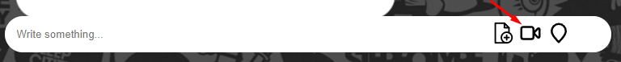
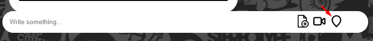

## Выполнены реализованные функции:

1. Сохранение в истории ссылок и текстовых сообщений --> Здесь ввод осуществляется в поле внизу и сохраняется после нажатия Enter.

2. Ссылки (http:// или https://) должны быть кликабельны и отображаться, как ссылки --> Здесь они кликабельны и отображаются как ссылки.

3. Сохранение в истории изображений, видео и аудио (как файлов) — через Drag & Drop и через иконку загрузки --> Здесь img, video, audio сохраняются и через Drag & Drop тоже работает. Отправка файлов через иконку Upload тоже работает.

4. Скачивание файлов на компьютер пользователя --> Скачиваются файлы на компьютер устройства пользователя.

5. Поиск по сообщениям (интерфейс + реализация на сервере) --> Для поиска введите искомый текст в поле, и чтобы сбросить поиск оставьте поле пустым и нажмите Enter

6. Запись видео, используя API браузера --> Для начала записи видео нажмите иконку (videocamera), и для сохранения или сброса видео воспользуйтесь кнопками

7. Воспроизведение видео/аудио, используя API браузера --> Воспроизводится при нажатии
8. Отправка геолокации --> Чтобы получить свое местоположение нажмите на иконку (location)

9.  Просмотр вложений по категориям: аудио, видео, изображения --> Чтобы выбрать категорию воспользуйтесь кнопками фильтра сверху, и если чтобы сбросить категорию воспользуйтесь иконку (three layer)
